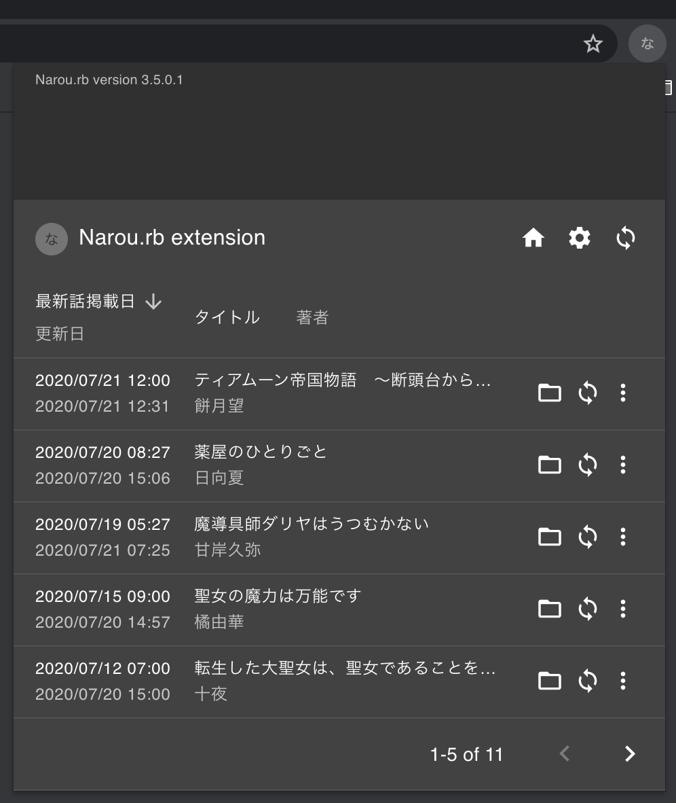

# Narou.rb-extension

> Narou.rb をちょっとだけ便利に使える Google Chrome の拡張機能

## 必要なもの

- [Narou.rb](https://github.com/whiteleaf7/narou) で WEB UI が起動している必要があります
- [Narou.rb Docker Image](https://github.com/whiteleaf7/narou-docker) でコンテナを起動すると楽です
- WEB UI をデフォルト以外のポートで起動している場合は、「拡張機能のオプション」から設定してください

## できること

- 書籍の一括（個別）更新
- 端末へ送信
- 電子書籍へ変換
- 凍結（解凍）
- 削除
- フォルダを開く
  - Docker コンテナで起動している場合は開くことができません
- Chrome のコンテキストメニューに「この小説を Narou.rb でダウンロード」が追加されます
  - `ncode` をコピペする必要がなくなります

## できないこと

- できること以外
- Narou.rb の細かな設定などは Narou.rb の WEB UI や CLI を使ってください

## 困ったときは

- Narou.rb の WEB UI が起動しているか確認してください
- WEB UI のポートを確認してください

## 注意事項・その他

- この拡張機能は [Narou.rb](https://github.com/whiteleaf7/narou) の作者さんとは一切関係ありません。この拡張機能のお問い合わせはこちらまでどうぞ
- Narou.rb でできないことはできません
- 「小説家になろう」は株式会社ヒナプロジェクトの登録商標です
